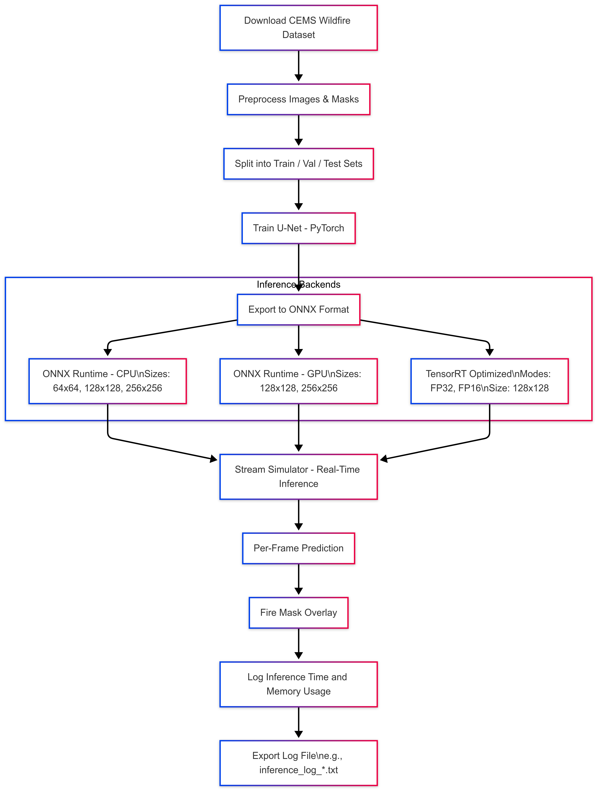

# Edge-to-Cloud Wildfire Detection System

This project implements a real-time wildfire detection pipeline optimized for edge-to-cloud deployment using satellite imagery from the CEMS Wildfire Dataset. The system uses a U-Net model for semantic segmentation, trained and evaluated on preprocessed Sentinel-2 images.

With a focus on scalable inference, this solution incorporates distributed model training, ONNX Runtime deployment, performance profiling, and a Streamlit dashboard. It simulates edge-based image streaming to evaluate latency and memory usage — making it a strong demonstration of system-level thinking for AI deployment at scale.

## Features

- **Dataset Integration:** Uses open-source Sentinel-2 satellite imagery from the CEMS Wildfire Dataset
- **Semantic Segmentation:** U-Net architecture trained to detect wildfire-affected regions at pixel level
- **Preprocessing Pipeline:** Converts raw GeoTIFF data into normalized, resized NumPy arrays with masks
- **Distributed Training:** Supports PyTorch-based multi-GPU training using DistributedDataParallel (DDP)
- **ONNX Model Export:** Converts PyTorch model to ONNX for inference acceleration
- **Stream Simulator:** Simulates image streaming from edge devices with real-time frame-by-frame inference
- **Performance Profiling:** Logs inference latency and memory usage per frame with summary metrics

## Pipeline Overview

### 1. Dataset Acquisition

- The dataset is sourced from the [CEMS Wildfire Dataset](https://github.com/MatteoM95/CEMS-Wildfire-Dataset), which contains high-resolution Sentinel-2 satellite images and annotated fire masks.

### 2. Preprocessing

- Raw satellite images and segmentation masks are resized, normalized, and converted to NumPy arrays for model compatibility.
- The script `preprocess.py` processes the data into training, validation, and test sets stored in `data/processed/`.
- The target resolution is configurable (e.g., 64×64, 128×128, 256×256), which allows benchmarking at different levels of spatial fidelity.

### 3. Model Training (PyTorch U-Net)

- A U-Net model (`unet_model.py`) is used for semantic segmentation of fire regions in Sentinel-2 RGB images.
- Training is implemented using PyTorch (`train_unet.py`), with support for GPU acceleration and mini-batch training.
- Model checkpoints are saved locally as `.pth` files.

### 4. Model Export (ONNX)

- The trained PyTorch model is exported to the ONNX format using `export_onnx.py`.
- ONNX allows portable, framework-independent inference and serves as a gateway to backend-specific optimizations (e.g., TensorRT, OpenVINO).
- Exported models are saved in the `models/` directory.

### 5. Inference Pipeline

- Inference on a static image is supported using `infer_onnx.py`.
- Real-time inference on a sequence of test frames is performed using `stream_simulator.py`.

### 6. Stream Simulation and Performance Logging

- The stream simulator loads preprocessed frames and performs ONNX inference one-by-one at a configurable FPS (e.g., 2 FPS).
- Each frame is passed through the model, and the output mask is used to create a visual overlay.
- Latency and memory usage per frame are measured using `time.perf_counter()` and `psutil`.
- Results are logged to timestamped `.txt` files in the `logs/` directory.
- Final summaries include average inference time, standard deviation, and memory usage.

### 7. Benchmarking

- Multiple conditions are benchmarked: different resolutions, devices (CPU/GPU), and optimizations (e.g., TensorRT, FP16).