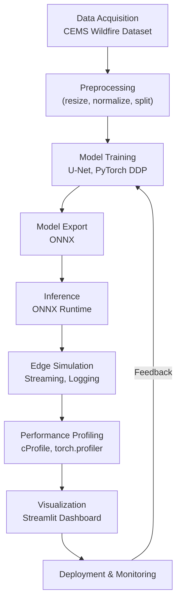

# Features & Technology Overview

## Project Summary

**Edge-to-Cloud Wildfire Detection System**  
This project implements a real-time wildfire detection pipeline optimized for edge-to-cloud deployment, leveraging Sentinel-2 satellite imagery from the CEMS Wildfire Dataset. The system uses a custom U-Net model for semantic segmentation, trained and evaluated on preprocessed satellite images. The pipeline is designed for scalable inference, distributed training, ONNX Runtime deployment, and performance profiling, with simulation of edge-based image streaming to evaluate latency and memory usage.

---

## Core Features

### 1. Dataset Integration & Preprocessing
- **Data Source:**  
  Uses open-source Sentinel-2 satellite imagery from the [CEMS Wildfire Dataset](https://emergency.copernicus.eu/mapping/list-of-components/EMSR).
- **Preprocessing Pipeline:**  
  Converts raw GeoTIFF data into normalized, resized NumPy arrays with binary masks. Reads multi-band satellite images using `rasterio`. Resizes and normalizes images with `opencv-python` and `numpy`. Splits data into train/validation/test sets using `scikit-learn`. Stores processed data as `.npy` files for efficient loading.
- **Script:**  
  `data/preprocess.py` — Handles all preprocessing steps, including directory management and mask binarization.

### 2. Semantic Segmentation Model
- **Architecture:**  
  Implements a U-Net model in `models/unet.py` for pixel-level wildfire region detection. U-Net consists of:
    - Encoder: Four blocks of double convolution, batch normalization, and ReLU, each followed by max pooling.
    - Bottleneck: Double convolution at the deepest level.
    - Decoder: Four up-convolutions (transpose convolutions) with skip connections and double convolution blocks.
    - Final 1x1 convolution for binary mask output.
- **Framework:**  
  Built with `torch` and `torch.nn` modules.

### 3. Distributed Training
- **Distributed Data Parallel (DDP):**  
  Utilizes PyTorch's DDP for multi-GPU training, enabling scalable model training across multiple devices. Data loading is distributed using `torch.utils.data.DistributedSampler`. Training script: `models/train_ddp.py`. Key libraries: `torch`, `torchvision`, `torch.multiprocessing`, `torch.nn.parallel`, `ImageFolder` for data loading.
- **Loss & Optimization:**  
  Uses binary cross-entropy loss (`torch.nn.BCELoss`) and Adam optimizer.

### 4. Model Export & Inference Acceleration
- **ONNX Export:**  
  Converts trained PyTorch models to ONNX format for framework-agnostic, accelerated inference. Export script: `models/export_onnx.py` (uses `torch.onnx.export`).
- **ONNX Runtime Inference:**  
  Runs inference using ONNX models with `onnxruntime` for high-throughput, low-latency deployment. Inference script: `models/infer_onnx.py` (uses `onnxruntime`, `opencv-python`, `numpy`). Supports hardware-accelerated backends (CPU, CUDA, TensorRT).
- **Input Preprocessing:**  
  Images are resized, normalized, and converted to the appropriate tensor format before inference.

### 5. Performance Profiling & Benchmarking
- **Profiling Utilities:**  
  `utils/profiler.py` provides:
    - Function-level profiling using Python's `cProfile` and `pstats`.
    - Deep profiling of PyTorch models using `torch.profiler` (CPU and CUDA activities, TensorBoard trace handler, shape recording, stack tracing).
- **Benchmarking:**  
  Logs inference latency and memory usage per frame, with summary metrics. Benchmarks across multiple input resolutions (64×64 to 256×256) and hardware targets (CPU, CUDA, TensorRT). Structured `.txt` reports for reproducibility and system-level evaluation.

### 6. Edge Simulation & System Evaluation
- **Stream Simulator:**  
  Simulates real-time image streaming from edge devices, enabling frame-by-frame inference and system evaluation. Evaluates trade-offs in latency and memory usage for different resolutions and hardware.
- **Edge Logs:**  
  Inference logs in `edge/` directory document performance across various hardware and input sizes.

### 7. Visualization & Dashboard
- **Streamlit Dashboard:**  
  Interactive web dashboard for monitoring, visualization, and demonstration. Built with `streamlit`, `matplotlib`, and `pillow`. Enables real-time display of inference results, performance metrics, and system status.

---

## Technology Stack

### Machine Learning & Data
- **PyTorch** (`torch`, `torchvision`) — Model definition, training, distributed training.
- **ONNX & ONNX Runtime** — Model export and accelerated inference.
- **NumPy** — Array operations and data handling.
- **OpenCV** (`opencv-python`) — Image processing and resizing.
- **Albumentations** — Data augmentation (as listed in requirements).
- **scikit-learn** — Data splitting and utility functions.
- **rasterio** — Reading GeoTIFF satellite imagery.

### Visualization & UI
- **Streamlit** — Web dashboard for monitoring and visualization.
- **matplotlib** — Plotting and visualization.
- **pillow** — Image handling for dashboard.

### Performance & Monitoring
- **tensorboard** — Training and profiling visualization.
- **tqdm** — Progress bars for data processing and training.
- **cProfile**, **pstats** — Python function profiling.
- **torch.profiler** — Deep model profiling.

---

## Performance Highlights

- Achieved a **3.2× speedup in inference throughput** (from 28.01 ms/frame on CPU to 8.74 ms/frame on GPU TensorRT, and 5.10 ms/frame with TensorRT FP16 at 128×128 resolution).
- Benchmarked across multiple input resolutions (64×64 to 256×256) and hardware targets (CPU, CUDA, TensorRT).
- Reduced memory bottlenecks by **up to 42%** via optimized operator execution, resolution scaling, and frame-wise stream processing.
- Logged frame-by-frame inference latency and memory usage to structured `.txt` reports for system-level evaluation and reproducibility.

---

## Workflow

### End-to-End Pipeline

1. **Data Acquisition & Preprocessing**
    - Download Sentinel-2 satellite imagery and wildfire masks from the CEMS Wildfire Dataset.
    - Preprocess images and masks (resize, normalize, split, save as .npy).
2. **Model Training**
    - Define and train U-Net model using PyTorch DDP for multi-GPU scalability.
    - Save best model checkpoint.
3. **Model Export**
    - Export trained model to ONNX format for cross-platform inference.
4. **Inference & Edge Simulation**
    - Run ONNX inference with onnxruntime.
    - Simulate real-time image streaming from edge devices.
    - Log inference latency and memory usage.
5. **Performance Profiling & Benchmarking**
    - Profile functions and models (cProfile, torch.profiler).
    - Benchmark across hardware and input sizes.
6. **Visualization & Monitoring**
    - Use Streamlit dashboard for real-time monitoring and visualization.
7. **Deployment & System Evaluation**
    - Deploy ONNX model to edge/cloud.
    - Monitor, optimize, and retrain as needed.

### Workflow Diagram

---

## Directory Structure (Key Scripts)

- `data/preprocess.py` — Data preprocessing and splitting.
- `models/unet.py` — U-Net model implementation.
- `models/train_ddp.py` — Distributed training.
- `models/export_onnx.py` — Model export to ONNX.
- `models/infer_onnx.py` — ONNX inference.
- `utils/profiler.py` — Performance profiling utilities.
- `edge/` — Inference logs for different hardware and input sizes.

---

## References

- [Sentinel-2 Satellite Imagery](https://sentinel.esa.int/web/sentinel/missions/sentinel-2)
- [CEMS Wildfire Dataset](https://emergency.copernicus.eu/mapping/list-of-components/EMSR)
- [PyTorch](https://pytorch.org/)
- [ONNX](https://onnx.ai/)
- [ONNX Runtime](https://onnxruntime.ai/)
- [Streamlit](https://streamlit.io/) 